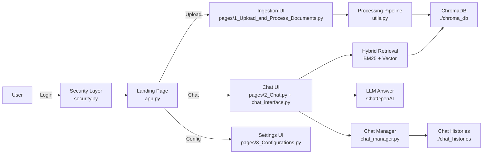

## Maxwell AI — Product and Technical Brief

### Elevator pitch
Maxwell AI is a secure, enterprise‑ready copilot that turns your organization’s documents into answers. Upload files, index them into a vector database, and chat with trustworthy, source‑grounded responses. Built with a modular architecture, Maxwell is designed to grow into a full Copilot platform across RAG, web search, database copiloting, Model Context Protocol (MCP) tools, and more.

---

## Objectives and value proposition
- **Primary objective**: Deliver a reliable, explainable copilot that understands your documents and accelerates decision‑making with traceable answers.
- **For business stakeholders**: Faster access to knowledge, reduced time to insight, transparent citations for trust and compliance, and a foundation to add company‑specific skills (web search, databases, workflows).
- **For technical teams**: Clear architecture, strong separation of concerns, pluggable components (LLMs, embeddings, retrievers, vector stores), and maintainable code.

---

## What’s implemented today

### 1) Authentication and security
- **Secure login flow** with hashed credentials using `bcrypt` and per‑user session state.
- **Rate limiting and IP blocking** (configurable) to reduce brute‑force risk.
- **Config‑driven** via `config.yaml` with usernames, emails, hashed passwords, and security policies.
- Key files: `security.py`, `config.yaml`, integrated in `app.py` and all `pages/*`.

### 2) Document ingestion and processing
- **Multiple formats supported**: PDF, TXT, DOCX, CSV, XLS/XLSX via LangChain loaders.
- **Chunking** using `RecursiveCharacterTextSplitter` with defaults: size 2000, overlap 500.
- **Document‑level enrichment**: One LLM pass per document produces a structured Spanish summary; applied to all chunks as metadata (`document_summary` and `summary`).
- **File provenance** kept in metadata (`source_file`), plus loader metadata (e.g., PDF page numbers).
- **UI flows** to create/delete vector DB collections and upload/process files.
- Key files: `pages/1_Upload_and_Process_Documents.py`, `utils.py`.

### 3) Vector store and retrieval (RAG)
- **ChromaDB (persistent)** as the vector store (`./chroma_db`).
- **Hybrid retrieval**: Dense (vector) + sparse (BM25) via `EnsembleRetriever`.
- Optional **cross‑encoder reranking** is available in the legacy backup (`2_Chat_backup.py`), disabled in the new chat page for speed.
- **Source citation policy**: The prompt requires sources and page numbers to be cited in answers.
- Key files: `pages/2_Chat.py` (current), `2_Chat_backup.py` (legacy with reranker example).

### 4) Chat experience and history management
- **Multi‑chat per user per collection**: create, select, rename, delete chats.
- **Auto‑save** after every message; **export** chat as JSON; **statistics** (counts, most active chat).
- **Explainability**: Assistant responses include an expander with source documents and per‑document summaries.
- **State** identified by a stable `current_user_id` derived from session.
- Key files: `chat_interface.py`, `chat_manager.py` (new), `chat_storage.py` (legacy compatibility).

### 5) Configurability (UI)
- In‑app configuration for LLM and retrieval:
  - **LLM**: `gpt-4o-mini` (default), `gpt-4o`, `gpt-4`, `gpt-3.5-turbo` with temperature.
  - **Embeddings**: `text-embedding-3-large` (OpenAI) or `sentence-transformers/all-MiniLM-L6-v2` (HF).
  - **Retrieval**: `hybrid | semantic | keyword`, `top_k`, chunk size and overlap.
- Config persists in `st.session_state` during session.
- Key file: `pages/3_Configurations.py`.

### 6) UX and theming
- **Modern, brand‑consistent styling** (green theme), clean landing page, simplified navigation.
- Responsive layouts and polished controls for a professional feel.
- Key files: `app.py`, `pages/*` (custom CSS blocks).

### 7) Utilities and scripts
- **Pickle cleanup** migration script for older storage patterns: `cleanup_pickle_files.py`.
- **Demo integration** showcasing how to embed the chat manager/UI: `demo_chat_integration.py`.

---

## How it works (high‑level)
1. User authenticates; upon success, the landing page offers three flows: upload/process, chat, and configuration.
2. In “Subir y Procesar Documentos”:
   - Create/select a ChromaDB collection; upload documents; chunk and enrich with LLM summaries.
   - Generate embeddings and persist chunks in Chroma.
3. In “Conversar con Documentos”:
   - Select a collection; initialize RAG chain (embeddings + hybrid retrieval).
   - Ask a question; the system retrieves relevant chunks, composes a grounded answer, and shows citations.
   - All messages are saved per user and collection; manage multiple chats.



---

## What’s working well (business + technical)
- **Trustworthy answers** with visible citations and page references improve user confidence and compliance.
- **Scalable ingestion** across common business file types; document summaries boost recall and retrieval quality.
- **Hybrid retrieval** offers robust performance across diverse query styles.
- **Operational simplicity**: ChromaDB persistence and JSON chat histories make backups and migrations straightforward.
- **Extensibility**: Clean abstractions (`ChatInterface`, `ChatManager`, utility processing) are designed to add new skills and tools.

---

## Improvements needed (short‑term)
- **Chunking strategies by document type**: The UI exposes a `doc_type` selector but currently uses a single chunker. Implement tailored strategies for contracts, forms, and general docs (e.g., header‑aware, table awareness).
- **Optional reranking toggle**: Provide a switch to enable cross‑encoder reranking for quality‑critical sessions (currently only in backup script).
- **Configuration persistence**: Persist settings beyond session (e.g., YAML/DB) and support per‑workspace defaults.
- **Access control**: Scope ChromaDB collections by organization/workspace; hide collections the user shouldn’t see.
- **Real client IP**: Rate‑limit and blocking currently use a placeholder (`127.0.0.1`); integrate real IP/header extraction for production.
- **Granular data management**: Add document‑level delete/update and re‑index flows (not only collection‑level delete).
- **Deployment artifacts**: Add `requirements.txt`/`pyproject.toml`, `.env.example`, and Dockerfile for reproducible deployments.
- **Observability**: Centralized logs/metrics; optional LangSmith/OpenTelemetry integration for tracing RAG quality.
- **Internationalization**: Spanish‑first UX; add language toggle and localized prompts.

---

## New capabilities to build (roadmap)

### A) RAG excellence and scalability
- **Adaptive chunking**: Heuristic/layout‑aware chunking (PDF structure, headings, tables), content‑aware chunk size.
- **Citations UX**: Clickable citations that open side‑by‑side source preview with highlights; exportable answer with bibliography.
- **Indexing operations**: Scheduled crawls, incremental updates, deduplication, and PII scrubbing/redaction.
- **Pluggable vector backends**: Support `pgvector`, Pinecone, Weaviate, Qdrant, Milvus, Vespa.
- **Multi‑tenant isolation**: Org/workspace separation for embeddings and histories.

### B) Web search augmentation
- **Live web search** to complement private RAG: integrate Tavily/Brave/Bing APIs.
- **Source control**: Clear labeling of internal vs external evidence; policy‑based filters and domain allowlists.
- **Caching and freshness**: Short‑TTL cache and freshness scoring for web results.

### C) Database copilot (SQL/NOSQL)
- **Safe NL→SQL agent** with read‑only and guarded write modes; schema introspection and semantic catalog.
- **Connectors**: PostgreSQL, MySQL, MSSQL, BigQuery, Snowflake; credentials stored securely.
- **Query verification**: Dry‑run checks, row/column governance, and cost guards.
- **Answer composition**: Combine SQL results with RAG context; export to CSV/Excel; charting previews.

### D) MCP (Model Context Protocol) tool ecosystem
- **MCP client integration** to access standardized tools (filesystem, calendar, Slack/Jira, HTTP, Git, etc.).
- **Policy and guardrails**: Tool sandboxing, approval flows, rate limits per tool.
- **Composable skills**: Task graphs orchestrating RAG retrieval, DB queries, and external tools under one instruction.

### E) Agent skills and governance
- **Function calling** for structured actions; plug in tools for web, DB, files, notifications.
- **Safety**: Prompt hardening, input validation, output filters, and audit logs.
- **Feedback loop**: Thumbs up/down, rationale capture, and dataset generation for evaluation.

### F) Enterprise connectors and ingestion
- **Repositories**: SharePoint, Google Drive, OneDrive, S3, Confluence, Notion, Jira.
- **Schedulers & webhooks**: Background jobs for syncing and re‑indexing; change‑data capture.

### G) Evaluation and quality
- **RAG evaluation suite** (e.g., RAGAS): answer relevance, faithfulness, context precision/recall.
- **A/B testing** for prompts, retrievers, and rerankers.

### H) Platform & DevEx
- **Provider abstraction**: Azure OpenAI, Anthropic, Google, local models (Ollama) with a single interface.
- **Deployment**: Docker/Kubernetes; environment templating for cloud and on‑prem.
- **Testing**: Unit tests for loaders/chunkers; integration tests for RAG chain and chat flows.

---

## Phased plan (suggested)
- **Phase 1 (2–3 weeks)**: Doc‑type chunking, reranking toggle, config persistence, real IP handling, requirements/Dockerfile, LangSmith tracing.
- **Phase 2 (3–4 weeks)**: Web search integration, DB copilot (read‑only), document‑level management, RBAC for collections.
- **Phase 3 (4–6 weeks)**: MCP tools, agent function‑calling with guardrails, enterprise connectors, RAG evaluation suite.

Each phase should ship with acceptance criteria (e.g., “web answers labeled and cached; <500ms added latency; >15% answer recall uplift in eval set”).

---

## Key files and modules
- `app.py`: Landing page, global CSS, navigation, session verification.
- `pages/1_Upload_and_Process_Documents.py`: Collection management, uploads, processing and indexing into Chroma.
- `pages/2_Chat.py`: Chat page with hybrid retrieval and the new chat interface.
- `pages/3_Configurations.py`: In‑app configuration for LLM and retrieval.
- `utils.py`: Loaders, chunking, and document‑level summarization/enrichment.
- `chat_interface.py` + `chat_manager.py`: Multi‑chat management UI and persistence.
- `security.py` + `config.yaml`: Auth, rate limiting, and security policies.
- `2_Chat_backup.py`: Legacy chat with cross‑encoder reranking sample.
- `cleanup_pickle_files.py`: One‑time migration utility for older storage.

---

## Environment and prerequisites
- Python 3.10+
- Environment variables:
  - `OPENAI_API_KEY` (required when using OpenAI models)
  - `VISION_AGENT_API_KEY` (optional, for advanced OCR features)
- Suggested (to add): `requirements.txt`, `.env.example`, Dockerfile

### API Key Configuration
Maxwell AI now includes a built-in API key management system accessible through the Configuration page:

1. **Web Interface**: Navigate to "Configuraciones" → "Configuración de Claves API"
2. **Visual Status**: See which API keys are configured with status indicators
3. **Secure Input**: Enter API keys through password-protected inputs
4. **Auto-save to .env**: Keys are automatically saved to your `.env` file
5. **Environment Reload**: Reload environment variables without restarting

**Supported API Keys:**
- **OpenAI API Key**: Required for GPT models and OpenAI embeddings
- **Vision Agent API Key**: Optional for enhanced OCR and document analysis

**Setup Process:**
1. Go to the Configuration page in the web interface
2. Enter your API keys in the secure input fields
3. Click "Guardar" to save them to your `.env` file
4. Keys are automatically loaded on application restart

**Manual Setup (Alternative):**
Create a `.env` file in the project root:
```
OPENAI_API_KEY=your_openai_api_key_here
VISION_AGENT_API_KEY=your_vision_agent_api_key_here
```

---

## Closing note
Maxwell AI already delivers a dependable, explainable RAG assistant with a clean UX. The roadmap above turns it into a full‑fledged copilot—augmenting private knowledge with live web context, safe database reasoning, and a powerful MCP tool ecosystem—while maintaining enterprise‑grade security, observability, and governance. 